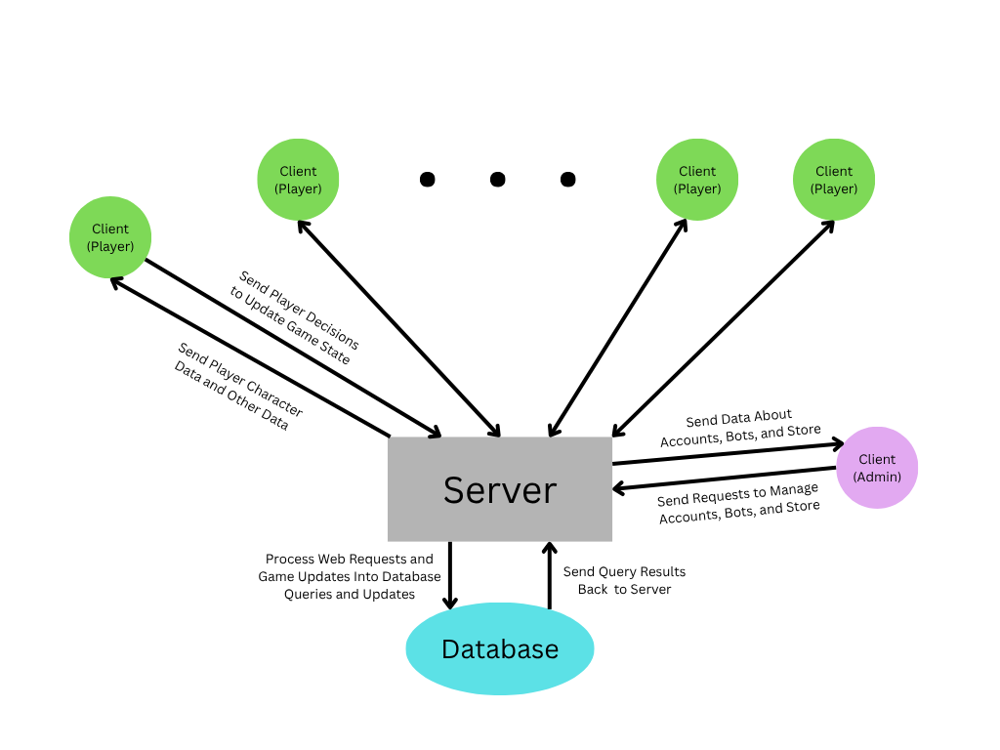
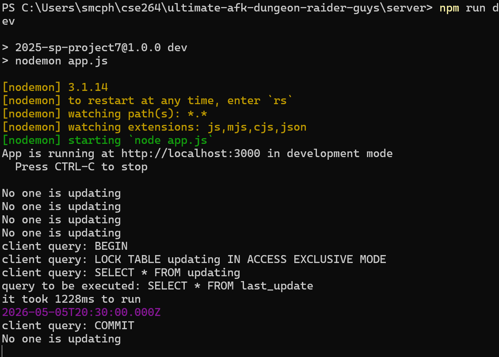
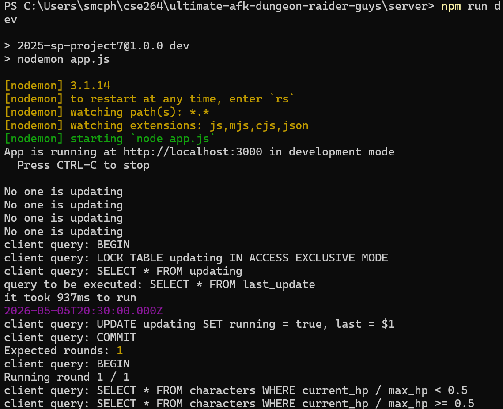

# CSE264 Final Project: Full Stack

## Due: Friday, May 2, 2025 at 11:59 PM

## Add your full name and Lehigh email address to this README!

Steven McPhillimey `slm526@lehigh.edu`, Demetri Kostas `dek226@lehigh.edu`, David Chen `dac326@lehigh.edu`

### Project Requirements

Your web application should have/do the following:

Your web application must include the following:

* User Accounts & Roles: Implement different user roles such as user/admin, free/paid, etc.
* Database: Your application must store and retrieve data from a database of your choice.
* Interactive UI: Your web app must have an interactive user interface, which can include forms, real-time updates, animations, or other dynamic elements.
* New Library or Framework: You must use at least one library or framework that was not covered in class.
* Internal REST API: Your project must have an API layer used to store and retrieve data
* External REST API: You may include an external REST API (e.g., Reddit API, Spotify API, OpenWeather API, etc.).

## 1. Project Overview

### Ultimate AFK Dungeon Raider Guys

Ultimate AFK Dungeon Raider Guys is a simple game where user characters asynchronhously battle another random character every 30 minutes, allowing them to earn experience points to level up, and gold to purchase equips and potions from the shop. Users can view their position on the leaderboard, which displays the number of wins and losses of all characters.

The purpose of this game, like any game, is for the players to have some level of fun. The simplicity of this game allows it to be played at leisure, as players will be inclined to make their game decisions (such as what to purchase and equip), take a break, and then come back later once a few rounds of the game have passed. This simple, cyclical style of gameplay is built on the backend simulating rounds for every 30 minutes of real world time. Further features allowing for more user interaction (such as more control over when their characters battle and rest, or more control over how their stats are boosted at level up) would be another step towards allowing users to interact with their character while still maintaining the game's simple nature.

## 2. Team Members & Roles

Our Team:

* David Chen: Frontend (Admin)  
* Demetri Kostas: Frontend (User)
* Steven McPhillimey: Database, Backend/Application Logic

## 3. Application Features

* The Ultimate AFK Dungeon Raider Guys project satisfies all project requirements by implementing a multi-role system that distinguishes between Players, who engage in PVP battles, and Admins, who manage game content and moderate users.
* The application utilizes Supabase as its core database * to store and retrieve game states.
* The frontend is built using React to provide an interactive UI featuring dynamic character customization and live leaderboards.
* To fulfill the framework requirement, we will use react-hook-form for advanced input validation and MUI for specialized UI components.
* The app uses an internal REST API layer written in JavaScript that sits between the client and the database to process web requests and game updates to ensure seamless data flow across the application.

### Full Tech Stack

* Frontend - React (CSS, html)
* Backend - Javascript (expressjs)
* Database: Supabase
* Version control: Github
* Libraries: react-router, mui, react-hook-form (we will use this for user inputs and validating the inputs)
* Testing: Postman, Supabase

### Architecture Diagram

### Frontend Login

* Login validates against existing backend users data.
* Only accounts with `role = admin` are allowed to log into the admin portal.
* Only accounts with `role = user` are allowed to log into the user portal.
* Session is stored in browser `sessionStorage` and cleared on logout.

#### Currently Supported Admin Actions

* View users (moderation list UI)
* View bots list
* Create potions via `POST /potions`
* Create equips via `POST /equips`
* View current equips list

#### Currently Supported User Actions

* View character stats, level, gold, equips, and potions
* Purchase equips and potions from the shop
* Equip equips and use potions from the inventory
* View leaderboard

IMPORTANT: Unfortunately we cannot add characters from the frontend, however postman can be used with the POST `/users/:user_id/characters` route (requires character_name, optional character_type)

## 4. Installation & Setup Instructions

1. Clone repo with `git clone https://github.com/StevenM87/ultimate-afk-dungeon-raider-guys.git`
2. Start the server from `server/`:
   * `npm install`
   * `npm run dev`
3. Start the client from `client/`:
   * `npm install`
   * `npm run dev`
4. API routes can be viewed via browser (GETs only) or postman (any HTTP method) at:
   * `http://localhost:3000`
5. Open the admin portal at:
   * `http://localhost:5173/admin.html`
6. Open the player portal at:
   * `http://localhost:5173/user.html`

## 5. API Keys & Database Setup

.env file with environment variables are included in the email submission of the project (we didn't want to push them to the repo in the README). No other external configurations are needed and there are no external apis in use. The database can be viewed at `https://supabase.com/dashboard/org/kgnzwubvrqzlpcewvukp/team`.

### Backend

The backend is built with expressjs, and it serves as the point of transfer between the frontends and database, while also running the game battling logic.

The backend implements a query pooling method using Pool from pg, this allows for multi-query transactions to be excuted atomically, since they can be rolled back in the event of an error. This method is used in the 6 multi-write routes, and in the simulation running on the backend. All other routes use the same single query function we used in class.

The backend also implements a sort of server-to-server async communication via the database. Essentially, when there are rounds to run, multiple servers should not try to both execute this, as it would put the database out of a correct state. Using the updating singleton table allows the servers to check if there is updating occuring at a different server and also indicate to all other servers if this server is updating.

These checks can be seen occuring periodically here:

#### If no rounds need to be run

#### If some rounds need to be run

#### Database Tables

There are 10 tables in the database:

* users: Represents a user with their credentials, role (user, admin, bot), status (active or banned), and gold
* characters: Users have player characters who participate in the battling simulation, bots have bot characters who are also part of the simulation
* equips: A table of all the equips and their stats
* potions: A table of all the potions and their healing amounts
* user_equips: Equips purchased by a user that are not currently equipped to any character
* user_potions: Potions purchased by a user that they can use on their characters
* character_equips: These are the equips currently equipped on each character
* battles: Table that stores the result of every battle (winner, loser, and the round number)
* last_update: Singleton table, it contains the time of the last update to the simulation, and what the next round's number is, used by the simulation to detect when to run rounds
* updating: Singleton table, it contains an entry that indicates if there is a backend running the simulation somewhere, and the last time that backend indicated that it was running (if a backend somehow hangs while running, this prevents the backend from being stuck by freeing it after a certain amount of time with no updates)

#### Routes

The backend has 31 routes:

##### User Routes

* GET `/users` route that gets all users
* POST `/users` route that creates a user (requires username, password, role)
* GET `/users/roles/:role` route that gets all users with a specific role
* GET `/users/:user_id` route that gets a user by user_id
* DELETE `/users/:user_id` route that deletes a user by user_id (cannot delete admins)
* PUT `/users/:user_id/ban` route that bans a user by user_id (cannot ban admins)
* POST/PUT `/users/:user_id/buy/:type/:item_id` routes that allows a user to buy an item (equip or potion)
* GET `/users/:user_id/characters` route that gets all characters for a user
* POST `/users/:user_id/characters` route that creates a character for a user (requires character_name, optional character_type)
* GET `/users/:user_id/characters/:character_id` route that gets a specific character for a user
* DELETE `/users/:user_id/characters/:character_id` route that deletes a character for a user (returns equipped items to inventory)
* POST/PUT `/users/:user_id/characters/:character_id/equip/:slot/:item_id` routes that equips an item to a character
* POST/PUT `/users/:user_id/characters/:character_id/potion/:item_id` routes that uses a potion on a character
* PUT `/users/:user_id/earn` route that adds gold to a user (requires gold in body)
* GET `/users/:user_id/equips` route that gets all equips owned by a user
* GET `/users/:user_id/potions` route that gets all potions owned by a user
* PUT `/users/:user_id/gold` route that sets a user’s gold (requires gold in body)

##### Character Routes

* GET `/characters` route that gets all characters
* GET `/characters/battles` route that gets all battles
* GET `/characters/battles/:character_id` route that gets all battles for a character
* GET `/characters/records` route that gets win/loss records for all characters
* GET `/characters/records/:character_id` route that gets win/loss record for a character
* GET `/characters/:character_id` route that gets a character by character_id
* GET `/characters/:character_id/equips` route that gets all equips for a character

##### Item Routes

* GET `/equips` route that gets all equips
* POST `/equips` route that creates an equip (requires equip_name, equip_type, boost_type, boost_amount, cost)
* DELETE `/equips/:equip_id` route that deletes an equip by equip_id
* GET `/potions` route that gets all potions
* POST `/potions` route that creates a potion (requires potion_name, cost, heal_raw, heal_percent)
* DELETE `/potions/:potion_id` route that deletes a potion by potion_id

##### Additional Route

* POST `/rounds` route that adds simulation rounds (requires rounds as a positive integer in body)

## 6. Additional Features That We Could Add With More Time

* Adding characters from frontend
* 'Dungeon Mode' where characters can be set to battle through a dungeon instead of against other players
* Setting what percentage of hp that your character can battle at (so players can let their characters rest longer and heal up more fully if they want)
* The database is set to allow a user to have multiple characters, which we use for bots, but it could also be implemented for players
* 'Challenge Match' where you challenge another player to a battle instead of fighting a random opponent
* User selected level up perks (extra stats, special abilities, etc.)
* Guilds, a way for users to make teams that could battle other teams
* Tournaments between characters
* Individual character battle logs, similar to the leaderboard, it would be a way to view results
